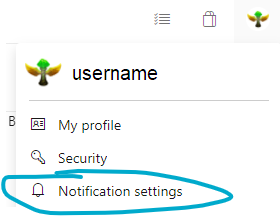
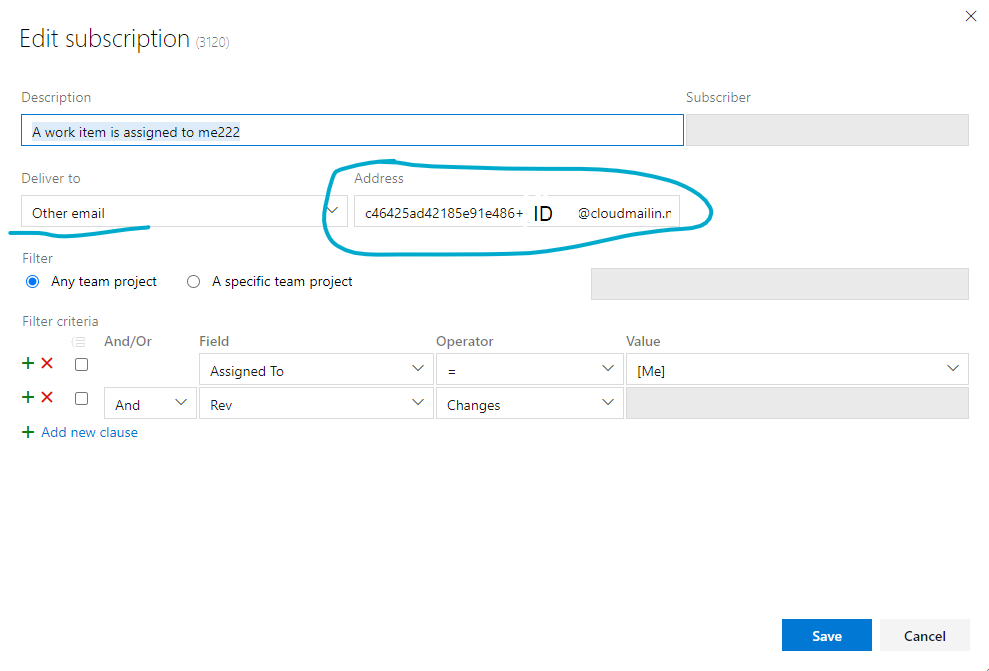

#  Flowerbot
Flowerbot - это Telegram-бот, позволяющий получать оповещения от TFS.

Для начала работы с ботом требуется выполнить следующие шаги:

1. Открыть бот в любом удобном клиенте - t.me/tfs_flowerbot.
2. Выполнить команду `/start`.
3. В появившемся приветственном сообщении будет указан ваш идентификатор - его нужно сохранить, он понадобится для дальнейшей настройки.
4. В TFS зайти в настройки оповещений (рисунок 1).

5. В настройках добавить необходимые оповещения, например о прикреплении новых рабочих элементов.
6. Настроить оповещение нужным пользователю образом, в качестве адреса доставки указать специальный адрес электронной почты: `c46425ad42185e91e486+``TELEGRAM_ID``@cloudmailin.net`, где после знака “+” нужно указать ваш идентификатор, полученный в пункте 3.

7. Критерии оповещений могут быть любыми.

Если все пункты выполнены правильно, то с момента завершения настройки в бот начнут поступать настроенные уведомления.
